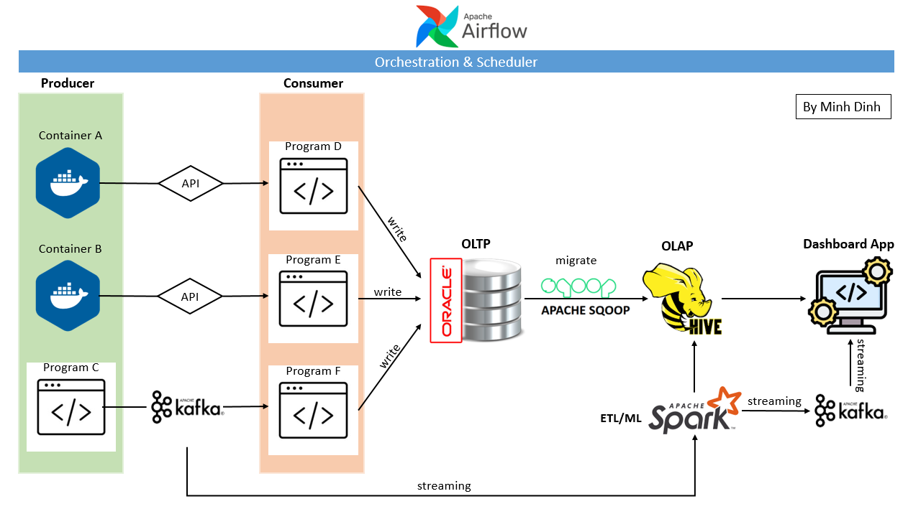
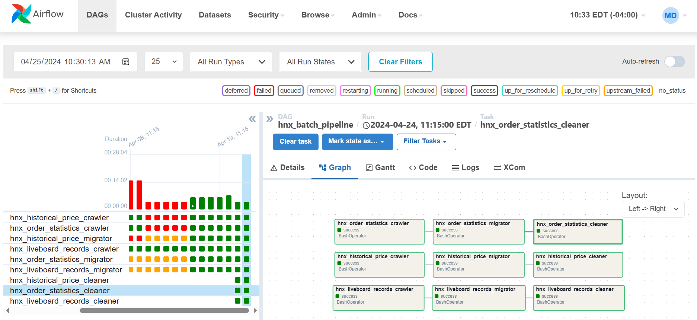

/!\ This project is **IN PROGRESS**.

<h2>ARCHITECTURE</h2>

<h3>1. Producer</h3>

* **Container A**: Provides API to retrieve historical price of a stock index.
* **Container B**: Provides API to retrieve order statistics of a stock index.
* **Program C**: Produce data scraped from a stock liveboard every 5 minutes to **Apache Kafka**

<h3>2. Consumer</h3>

* **Program D**: Retrieve historical price data from Container A then write to an OLTP database.
* **Program E**: Retrieve order statistics data from Container B then write to an OLTP database.
* **Program F**: Retrieve streaming liveboard data from **Apache Kafka** then write to an OLTP database.

<h3>3. OLTP Database</h3>

**Oracle 19c.**

<h3>4. OLAP Database</h3>

**Apache Hive.**

Apache Hive uses **HDFS (Apache Hadoop)** as data storage. The data is migrated from Oracle using **Apache Sqoop**.

<h3>5. ETL/ML</h3>

**Apache Spark**

Spark SQL is used to clean and transform data in Apache Hive. And, Spark ML is used to train a time-series model to predict stock price. The model will then be fitted to streaming data from Kafka to generate real-time prediction.

<h3>6. Dashboard App</h3>

The App is developed using Streamlit to present analytics visualizations and streaming stock price prediction.

<h3>7. Orchestration & Scheduler</h3>

**Apache Airflow**

The data processes of the platform is orchestrated and scheduled by Apache Airflow.

<h2>DEVLOPMENT</h2>

